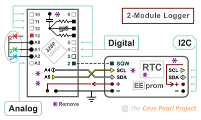

# 2-Part-ProMini-EEprom-Data-Logger_2022

This program supports an ongoing series of DIY 'Classroom Logger' tutorials from Edward Mallon & Dr. Patricia Beddows at the Cave Pearl Project. The idea is to provide a starting point for student projects in environmental monitoring courses and/or thesis level research.<br/>
<br/>The tutorial that matches this code can be found at:<br/>
https://thecavepearlproject.org/2022/03/09/powering-a-promini-logger-for-one-year-on-a-coin-cell/
<br/>with a detailed building guide video at:<br/>
https://www.youtube.com/watch?v=58ps9fUyY0Q&t=0s&ab_channel=EdwardMallon

---

This 'low power' 2-module iteration runs the logger from a CR2032 coin cell and uses  EEprom memory to store sensor readings. This necessarily involves several power optimization steps which add significant complexity to the base code (as compared to previous versions) but hopefully everyone can read through the code and understand what is happening from the extensive comments. There are several manual configuration settings controlled by #define statements at the start of the program, and the logger will not be able to read the coincell voltage properly until you tweak the InternalReferenceConstant. <br/> <br/>
Data download & logger control are managed  through the IDE's serial monitor window at 500000 baud. 
The logger WILL NOT START taking readings until those serial handshakes are completed via the UART connection.<br/><br/>

<figure></figure>
The code has support for a built-in NTC / LDR combination, Bmp280, BH1750, and PIR sensors. These are enabled / disabled by uncommenting define statements at the beginning of the code. Each sensor enabled after the single-byte LowBat & RTCtemp defaults contributes two additional bytes per sampling event because every sensor reading gets stored in a 16-bit integer. The total bytes per saved per record must total 1, 2, 4, 8 or 16 only. Modifying the logger base code for a new type of sensor requires edits only at the areas indicated by call out numbers on the following flow charts. These are labeled with comments: STEP1, STEP2, STEP3, etc. so you can locate those sections with the Find function in the IDE.  They are surrounded by rows of ++PLUS++ symbols:</br>
>//++++++++++++++++++++++++++++++++++++++++++++++++++++</br>
>// STEP1 : #include libraries & Declare Variables HERE</br>
>//++++++++++++++++++++++++++++++++++++++++++++++++++++</br>
</br>


If all you do is enable the supported sensors via defines at the start of the program you won't have to deal with the low-level storage details.


 However to add new sensors you'll need to understand the I2C transaction that transfers those sensor readings into the EEprom at the end of the main loop. This involves dividing your sensor variables into 8-bit pieces and adding those bytes to the wire transfer buffer. This is accomplished with bit-math operations or via the lowByte & highByte macros.  The general pattern when sending bytes to an I2C EEprom is:</br>

```
Wire.beginTransmission(EEpromAddressonI2Cbus);
Wire.write(highByte(memoryAddress));
Wire.write(lowByte(memoryAddress));
loByte = lowByte(SensorReadingVariable); Wire.write(loByte);
hiByte = highByte(SensorReadingVariable); Wire.write(hiByte);
```

**add more Wire.write statements here as needed**  
You can ONLY add a total of 1, 2, 4, 8 or 16 DATA bytes to the I2C transaction. Powers of two increments are required because the recorded data must align with page boundaries inside the EEprom.

```
Wire.endTransmission();
```

The key insight here is that the wire library is only loading a memory buffer until Wire.endTransmission() is called. So it does not matter how much time you spend doing calculations, or slicing the variables, so long as you don't try and start another I2C transaction while you are still in the middle of this one. Once that buffer is physically sent over the wires, the EEprom enters a self-timed writing sequence and the logger reads the rail voltage while the CR2032 is under load. </br>

The data download function in setup retrieves those separate bytes and concatenates them back into the original integers - so the sequence of operations in the sendData2Serial function -STEP6- must exactly mirror the byte-order used to load the EEprom in the main loop.

---

Note: This script will still run on the older 3-module "Modules & Jumper Wires"  loggers described in the original Sensors paper: http://www.mdpi.com/1424-8220/18/2/530 
and provides a 'no SD card' operation on the older 2020 classroom logger described at https://thecavepearlproject.org/2020/10/22/pro-mini-classroom-datalogger-2020-update/ but you will have to change the LED pins.
